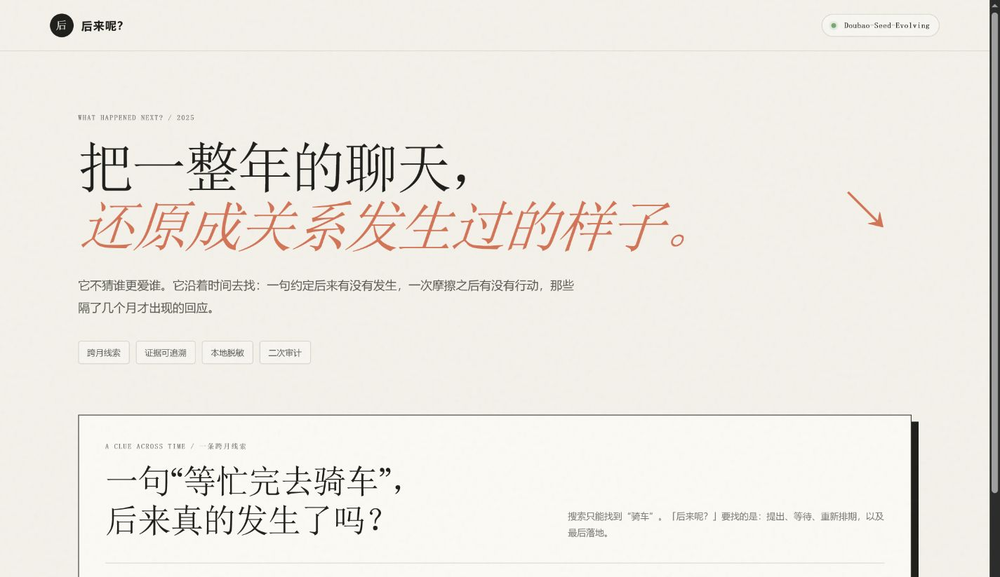

# 后来呢？ / Chat Later

把一年聊天整理成一份**可以点回原文的关系年鉴**。

它不判断谁更爱谁，也不做简单的正负面情绪打分。它沿着时间寻找一件事的起点与后来：一句约定有没有落地，一次反馈之后有没有行动，那些隔了几个月才出现的回应。



## 它能看到什么

- **跨月约定**：从提出、等待、重新排期到最终发生；
- **互动转折**：把一次反馈与后续行为放回同一条时间线；
- **未完成事项**：找回被新消息淹没的“下次再说”；
- **证据回看**：每个事实结论绑定 `E00001` 形式的原始消息编号；
- **判断边界**：观察与推断分开，证据不足时明确写“无法判断”。


点击报告中的证据编号，可以回到化名后的原文：


## 一条线索如何跨过 27 天

```text
03 / 09  “周末要不要去江边骑车？”
03 / 28  “必须，四月第一个周六。”
04 / 05  “我到地铁口了，今天风有点大。”
```

「后来呢？」关注的不是“骑车”出现了几次，而是这个约定如何从邀约变成行动。


## 快速体验

只需要 Python 3.10+，不依赖第三方包：

```powershell
python app.py
```

打开 `http://127.0.0.1:8765`，点击“载入虚构样例”，然后开始分析。

没有配置 API 时，页面会明确显示 `LOCAL PREVIEW · 未调用模型`。本地预览可以体验解析、脱敏、报告结构和证据交互，不会伪装成模型结果。

## 接入 Doubao-Seed-Evolving

项目使用火山方舟 Responses API：

```powershell
$env:ARK_API_KEY="你的火山方舟 API Key"
$env:ARK_BASE_URL="https://ark.cn-beijing.volces.com/api/v3"
$env:ARK_MODEL="doubao-seed-evolving"
$env:ARK_API_STYLE="responses"
python app.py
```

API Key 只从环境变量读取，不会写进项目文件。

## 三阶段 Agent

```text
聊天文本
  → 本地解析、证据编号与敏感信息遮盖
  → Seed Evolving 制定本次分析计划
  → 读取完整记录生成结构化报告
  → 带着报告重读原文，审计每条证据
  → 可视化关系年鉴
```


第一阶段决定这份记录应该关注什么；第二阶段建立完整叙事；第三阶段收紧过度推断、检查引用，并删除证据不足的结论。

## 支持的输入

推荐文本格式：

```text
[2025-01-03 23:27] 林舟: 辛苦啦，先喝水，想吐槽我就听着
[2025-01-03 23:42] 南星: 讲完好多了，谢谢你没急着给建议
```

也支持：

- TXT / Markdown 多行消息；
- `timestamp/sender/content` CSV；
- `date/time/name/message` 等常见中英文 CSV 表头。

项目不抓取微信数据，也不绕过客户端安全机制。请只使用自己有权处理、并已获得相关参与者同意的导出文本。

## 项目结构

```text
relationship_archaeology/
  parser.py       # 解析聊天并分配证据编号
  privacy.py      # 姓名化名与敏感字段遮盖
  prompts.py      # 计划、分析、审计 Prompt
  seed_client.py  # Responses API、限流退避与可选缓存
  service.py      # 三阶段任务编排
static/           # 零依赖 Web 界面
sample_data/      # 公开虚构聊天样例
tests/            # 核心解析与证据链测试
article/assets/   # README 与文章展示图
```

## 核心检查

```powershell
python -m unittest discover -s tests -v
```

公开样例与截图全部为虚构内容。`warmth` / `friction` 是帮助阅读时间变化的叙事指标，不是心理量表；报告不构成心理评估、医疗建议或关系裁决。
